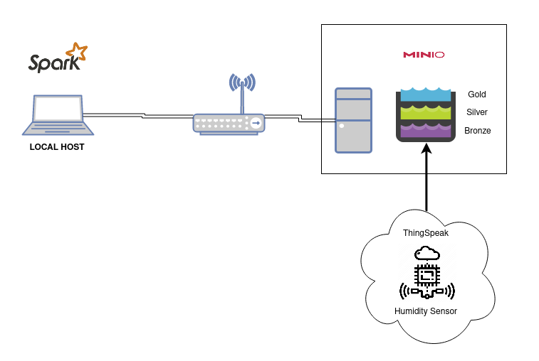
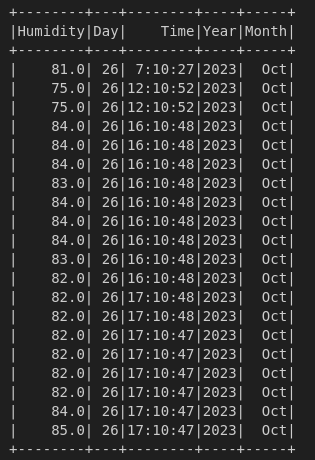

# Estudo de pipeline de dados com MinIO Object Storage e processamento de dados IoT no Apache Spark

###  Apresentação

Neste projeto, buscou-se aplicar diversos fundamentos básicos e intermediários que vão desde a programação em linguagem Python até ao uso de ferramentas de processamento de dados como o Apache Spark.

Um pipeline básico de dados foi criado, considerando que:

* Os dados coletados de uma plataforma de hospedagem de aplicações de Internet of Things (IoT) foram usados como fonte dos dados.
* Um serviço local de armazenamento de objetos foi implantado como alternativa ao oferecido pelo principal player de serviços em cloud.
* Utilizou-se o Apache Spark por meio da biblioteca Pyspark para realizar transformações nos dados.

Destaca-se que este projeto considerou o processamento dos dados em batch, mesmo tendo o conhecimento que a natureza dos dados IoT direcione ao processamento em streaming. Logo, estudos futuros pretendem realizar a aplicação do mesmo cenário porém com processamento em streaming. 

A figura abaixo representa a visão básica do ambiente criado.

    

### Etapas

A construção do projeto e, por consequência, do pipeline proposto ocorreu em 4 etapas.

1. Construção de um ambiente local
2. Implantação do serviço de storage local
3. Aquisição e Ingestão de dados da plataforma IoT
4. Processamento dos dados

#### 1. Construção de uma infraestrutura local

Visando o reforço nos conhecimentos de Sistema Operacional Linux, Redes de Computadores e Virtualização, buscou-se criar uma infraestrutura local com o uso de máquina virtual criada no VirtualBox. 

Assim, uma máquina virtual foi provisionada como serviço de storage de objetos contendo a seguinte configuração:

* SO: Ubuntu Minimal 18.08 configurado como servidor básico
* RAM: 2 GB
* HD: 30 GB
* Interface de Rede: modo bridge

Já a máquina hospedeira apresenta a seguinte configuração:

* SO: Linux Mint v21.1
* CPU: Core i7 8 núcleos
* RAM: 20 GB
* Python v3.10

#### 2. Implantação do serviço de storage local de objetos

O [MinIO](https://min.io/) foi escolhido como serviço de storage de objetos on-premises. Sua escolha se deu pela simplicidade de uso bem como pela similaridade em nível de programação com o ambiente do AWS S3 o que contribúi também para o processo de estudo de ferramentas e conceitos.

Ele foi implantado como um container Docker, seguindo o tutorial:

* [Setup MinIO with Docker](https://sanidhya235.medium.com/introduction-to-minio-193e8523a4a8)

No MinIO, criou-se 3 buckets seguindo os conceitos da Arquitetura Medallion:

* Bronze
* Silver
* Gold

#### 3. Aquisição e Ingestão de dados brutos no MinIO

Como fonte de dados, escolheu-se dados de natureza em tempo real obtidos de uma aplicação de IoT hospedada na plataforma ThingSpeak. Nela, as aplicações são definidas como canais (Channels) que podem ser privados ou públicos. 

Escolheu-se o [Channel ID: 1052510](https://thingspeak.com/channels/1052510) por representar dados coletados de uma estação meteorológica particular instalada na cidade de Belém-PA. É necessário realizar um cadastro simples na plataforma para poder acessar o URL de cada um dos dados dos sensores presentes no channel correspondente. Escolheu-se manipular dados referentes a:

* Umidade relativa do ar (%rH)
* Temperatura do ambiente (Celsius)
* Pressão Atmosférica (mBar)

Em relação à ingestão dos dados, ela segue as seguintes sequências:

1. Dado requisitado e recebido em formato JSON
2. Geração de arquivo em formato JSON sendo armazenado em um diretório local temporário
3. Arquivo JSON presente no diretório temporário é enviado ao bucket Bronze no MinIO
4. Arquivo JSON é excluído do diretório temporário
5. As etapas de 1 a 4 se repetem a cada x segundos

O diretório **dataingestion/** presente neste repositório possui um conjunto de scripts que são responsáveis pela aquisição e ingestão dos dados brutos, sendo eles:

* **datasource.py:** Responsável pela coleta de dado da plataforma ThingSpeak
* **bucketmanipuling.py:** Responsável pela ingestão dos dados no bucket Silver presente no MinIO
* **main.py:** Programa principal, pois interage com as classes presentes no datasource.py e bucketmanipuling.py bem como recebe parâmetros de execução, além de garantir o agendamento de execução
* **credentials.py:** Possui as credenciais de acesso aos serviços no MinIO. Elas são criadas dentro do próprio ambiente dele. 

Todos os scripts foram criados em lingugem Python v3.10 e executados em um terminal na máquina hospedeira.

#### 4. Processamento dos dados

Os dados presentes no bucket Bronze são lidos e então passam por alguns ajustes como:

* Mudança de nome de colunas
* Ajuste de tipo de dado
* Definição de Schema
* Criação de colunas referentes a ano, mês, dia e hora da coleta do dado pelo sensor
* Alteração do mês em formato de número para o formato de caractere

Em seguida, o Dataframe resultante é enviado ao bucket Silver em formato parquet com agrupamento por ano e mês. 

Toda esta etapa foi realizada no notebook **dt_datapipeline.ipynb** presente neste repositório sendo executado localmente na máquina hospedeira via VSCode. 

A figura abaixo representa a leitura do arquivo parquet presente no bucket Silver.

    

### Conclusão

Este projeto teve como objetivo reforçar diversos conceitos bem como ter contato com outros principalmente no contexto de "dados". Por ser um cenário local e genérico também permite estudar e aplicar outros conceitos e ferramentas como:

* Apache AirFlow
* Processamento em Streaming com Apache Spark Structured Streaming
* Apache Kafka
* ...

